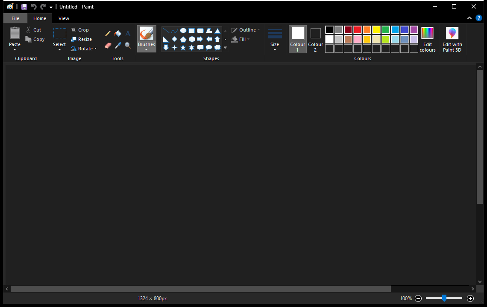

# Dark Paint (`mspaint-dark`)

A comprehensive, production-grade dark mode for Microsoft Paint on Windows 10 and 11, implemented as a [Windhawk](https://windhawk.net/) mod.



## Features

- **Classic Win32 Ribbon Theming (Windows 10)**:
  - Pitch-black title bar and non-client frame via DWM composition attributes.
  - Fully themed Windows Ribbon framework (tabs, command bar, QAT, application menu).
  - Dark status bar with high-contrast icons, dark trackbar slider, and custom dark size gripper.
  - Zero visual stutter or white flashing during window resizing and movement.
- **Dark Canvas Spawning**:
  - Automatically spawns new canvases with a dark background (`#202020` by default) instead of blinding white.
  - Synchronizes Color 1 (Pencil = White) and Color 2 (Eraser = Dark Canvas) upon document creation and reset.
- **Themed Modal Dialogs**:
  - Custom dark save/close confirmation prompt replacing the bright white TaskDialog.
  - Full keyboard navigation support (Enter, Escape, Tab navigation).
- **Modern WinUI / XAML Support (Windows 11)**:
  - Automatically requests Dark Application theme for Windows 11 Paint.
- **Dynamic Symbol Resolution**:
  - Automatically hooks internal symbols via Microsoft Symbol Server (`WindhawkUtils::HookSymbols`), ensuring portability across Windows cumulative updates without hardcoded offsets.

## Settings

The mod provides configurable options in Windhawk:

| Setting | Default | Description |
| :--- | :--- | :--- |
| `darkCanvas` | `true` | Automatically spawn new canvases with a dark background. |
| `canvasColor` | `#202020` | Hex color for the canvas background. |
| `workspaceColor` | `#282828` | Hex color for the workspace surrounding the canvas. |
| `ribbonBrightness` | `38` | Brightness level of the ribbon bar (0 to 100). |

## Installation

### Method 1: Via Windhawk UI
1. Open the **Windhawk** application.
2. In the **Home** or **Explore** tab, click the round floating **"Create a New Mod"** button in the bottom-right corner.
   *(Note: If you do not see this button, open Windhawk **Settings** and make sure **"Hide all development-related options"** is unchecked).*
3. Replace the template code with the code from [`mspaint-dark.wh.cpp`](mspaint-dark.wh.cpp).
4. Click **Compile Mod** in the sidebar.

### Method 2: Direct Folder Placement
Windhawk stores mods in `C:\ProgramData\Windhawk`:

- **Mod Source Files**:
  ```text
  C:\ProgramData\Windhawk\ModsSource\mspaint-dark.wh.cpp
  ```
- **Compiled Binaries**:
  - 64-bit: `C:\ProgramData\Windhawk\Engine\Mods\64\`
  - 32-bit: `C:\ProgramData\Windhawk\Engine\Mods\32\`

## License

[MIT](LICENSE)
